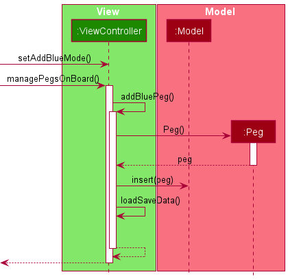
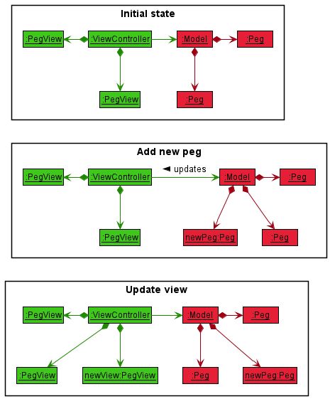
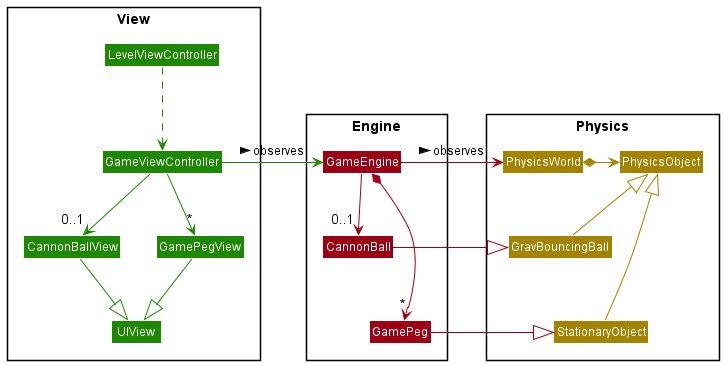
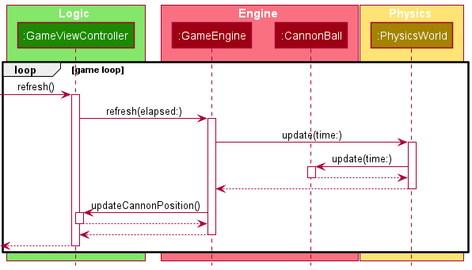

# CS3217 Problem Set 4

**Name:** Ong Ying Gao

**Matric No:** A0201924N

## Tips
1. CS3217's docs is at https://cs3217.netlify.com. Do visit the docs often, as
   it contains all things relevant to CS3217.
2. A Swiftlint configuration file is provided for you. It is recommended for you
   to use Swiftlint and follow this configuration. We opted in all rules and
   then slowly removed some rules we found unwieldy; as such, if you discover
   any rule that you think should be added/removed, do notify the teaching staff
   and we will consider changing it!

   In addition, keep in mind that, ultimately, this tool is only a guideline;
   some exceptions may be made as long as code quality is not compromised.
3. Do not burn out. Have fun!

## Dev Guide
> You may put your dev guide either in this section, or in a new file entirely.
> You are encouraged to include diagrams where appropriate in order to enhance
> your guide.

### Architecture

Overall, NotPeggle can be split into three components, `LevelDesigner`, `Game` and
`Services`. As the name suggests, `LevelDesigner` is responsible for the level editor
and its subcomponents, `Game` is responsible for the actual game and its engines
and `Services` is responsible for utility static methods that the other two depend on.

The following diagram sums it up:

#### Level Designer

`LevelDesigner` follows the MVC pattern, comprising mainly a model
component and a view(-controller) component.

##### View
The view component comprises of controllers and view objects. 

The `LevelViewController` is responsible for: 
* initialising the controls on the screen such as the buttons and text field,
* updating the `Model` based on input from other view and
* creating, changing or removing `PegView`, `BlockView` UI objects based on those updates.

The `SaveTableViewController` is responsible for:
* displaying all saved levels from the application document directory
* removing unneeded saves (done through `Storage`) based on user input
* relaying a chosen save file back to the `LevelViewController` to be loaded.

`PegView` is the view representation of a `Peg`. and  `BlockView` is the counterpart
for `Block`.

##### Model
The model component comprises (from top-level to bottom) the `Model` struct,
the `Peg` and `Block` struct, and the `Point` struct. `Model` is composed of all `Peg`
and `Block` instances in the board at any point in time, and has operations for querying
and inserting/deleting objects.

`LevelObject` is a protocol that defines collision detection for objects in the `Model`,
and `Peg` and `Block` serves as its conforming structs.

A `Peg` is represented simply as a circle with a `Point` indicating its center
radius, and color.

A `Block` is represented as a rectangle with a `Point` as its center, its width and height
and its angle offset.

A `Point` represents a pair of x, y-coordinates
in a 2D plane.

##### Logic Flow in `LevelDesigner`
To examine the relationship between components in `LevelDesigner`, we will examine
what happens when a user selects the blue peg button and taps on the board to add a new blue
peg to the level.

The following sequence diagram shows the processes involved in adding a new blue peg.

1. Upon receiving a tap event on the blue `PegModeButton`, the view controller is set to
    add blue pegs to the board.
1. Upon receiving another tap event on the board, it creates a new blue `Peg` at the location
    of the tap
1. It adds the new peg to the model.
1. It then loads data from the model to the view, which includes displaying a new blue peg
    on the screen.

The following object diagrams show the state of the programme during the execution
of said processes.

1. In the initial state, let's have a board that already has 2 pegs present, both of which are
    displayed (represented by the `PegView` objects).
1. The events of the sequence event takes place and `newPeg` is created and added to the
    model.
1. The view controller detects that the change and creates the `newView` object to represent
    the extra peg and display it.

#### Game
`Game` is structured in an MVC fashion, with `GameEngine` serving as the model controlling
the state of objects within the game, and the `GameViewController` updating the model
and then updating the view based on observed changes to the model.

##### View
The `View` component comprises both the view objects and the `GameViewController`.
`GameViewController` is responsible for:
* Initialising the engine from existing level data
* Running the game loop
* Conveying user input to the engine
* Rendering view objects in each loop to match the data in the engine
* Popping itself off the view stack when the user leaves the game

The view objects comprise the `GamePegView`, `GameBlockView` and `CannonBallView`, 
which are, as their names suggests, the game representation of the pegs, blocks and cannon ball
as displayed in the UI.

##### Physics
Before we introduce the engine, one must understand the physics engine it is built upon.
The `Physics` component comprises the `PhysicsWorld` and `PhysicsObject`. The
`PhysicsWorld` represents the physics engine housing all `PhysicsObject`
instances. It primarily updates the positions of every object, after which it resolves any
collisions between them.

`PhysicsObject` represents an abstract 2D object that is affected by physics and has
operations for updating position and velocity and declarations for collision handling.

It is concretely subclassed by `PhysicsBlock` and `PhysicsBall`, which represents
an oriented-bounding box and circle in 2D space.

The physics component also includes several convenient blueprints for generic objects
such as an immovable circle (`StationaryObject` or a bouncy ball affected by gravity
(`GravBouncingBall`).

##### Engine
The `Engine` component comprises `GameEngine`, `PowerUpManager` and their
respective game objects and power-ups.

`GameEngine` handles game logic, it houses the pegs and cannon ball and updates their
position through the physics engine. It is also responsible for controlling the launch of
the cannon.

`PowerUpManager` is a component under `GameEngine` that handles the selection and
activation of power-ups when triggered by a green peg being hit.

`GamePeg`, `GameBlock` and `CannonBall` both subclass the `PhysicsObject` so they may
be stored in the physics engine and updated by it.

##### Logic Flow in `Game`
To illustrate the relationship between `Game` components in action, we shall examine how the game
updates the position of the cannon ball in its flight in the below sequence diagramme.

As we can see, at each step, the display calls `GameViewController.refresh()`. This cues
the view controller to call `GameEngine` to reload its data. The engine then calls on
`PhysicsWorld` to update the states of all objects within it, which includes the cannon ball location.
After the cannon ball's location has been updated, the engine then tells the observing view
controller to update its sprites, during which the latter updates the cannon ball position and other
sprites on the screen for the user to see.

#### Services
`Services` houses utility structs such as:
* `Storage` - handles persistence
* `ModelViewConverter` - provides functions for translating UI elements into model
  counterparts and vice versa
* `ModelGameConverter` - provides functions for translating level designer structs into 
  its game engine counterparts and vice versa
* `Constants` - information shared by both model and UI.

#### Patterns used
NotPeggle makes heavy use of the MVC pattern and observer/delegate patterns for relaying
information between objects.

There is also heavy use of the adapter pattern to minimise dependency between components
such as the converter structs found in `Services`.

## Rules of the Game
Please write the rules of your game here. This section should include the
following sub-sections. You can keep the heading format here, and you can add
more headings to explain the rules of your game in a structured manner.
Alternatively, you can rewrite this section in your own style. You may also
write this section in a new file entirely, if you wish.

### Cannon Direction
> Please explain how the player moves the cannon.

To use the cannon, the player must first aim the cannon, then fire a round.

Simply drag your finger over the playing area (with the beach background) to your intended
target. The cannon will automatically point directly at that location. Be warned! The cannon
will not account for gravity when turning, that is on you to figure out.

When you are ready to fire, hit the button that says "LAUNCH". The launch button also shows
the number of shots you have left. Firing the cannon causes that number to decrement by 1,
and the cannon immediately launches a ball towards wherever you aimed at. Aim carefully before
you do, because if you run out of shots too soon you lose!

The launch button is disabled when your previously-fired round has not yet left the screen,
or when the game has already ended. However, you can continue to aim the cannon wherever
you like in preparation for the next shot.

### Win and Lose Conditions
> Please explain how the player wins/loses the game.

When you start a level, the game calculates the minimum score you must obtain in order to win.
This score is calculated by the number of pegs you have multiplied by 100.
The player must aim to hit this goal by hitting pegs every turn. The scoring system is as follows:
1. Blue - 100 points
1. Green - 100 points
1. Orange - 200 points.

You win so long you hit the minimum score within your allocated shots.

If you run out of shots before you hit the minimum score, you lose!

And don't try to start a game without any pegs, if none are found the game will leave you a nasty message.

If your ball is stuck, don't worry, after around 10 seconds the game should remove the ball and any pegs
the ball had hit up to the point of removal, and will be taken as if the ball had fallen out of the area.

### Power-Ups
Green pegs are worth as much as blue pegs in points, but they activate power-ups when hit.
The two power-ups are Space Blast and Spooky Ball (or rather their clones). Hitting green pegs cause
them to activate in order with Space Blast first, then Spooky Ball, then Space Blast again, so on so forth.
Power-ups can be activated multiple times in one round so long the ball continuously hits green pegs.

#### Space Blast
Space Blast causes pegs in the vicinity of the green peg to be highlighted instantly, effectively allowing you
to score lots of points with a single hit.

#### Spooky Ball
Spooky Ball gives the ball an extra life, respawning it back at the top when after it falls through the ground.
Its effect does not stack, i.e. activating Spooky Ball multiple times will not grant the cannon ball anymore
respawns while until it has fallen out of the game area and has respawned.

That said, be careful not to get stuck! Since it would be meaningless to drop the ball vertically back down to where
it was stuck originally, the ball will be removed, regardless of whether you had the perk active.

## Level Designer Additional Features

### Peg Rotation
> Please explain how the player rotates the pegs.

There is a grey button labelled "ROTATE OR RESIZE" next to the erase button. When you tap on it, it will be
highlighted. That is your cue that you can now freely rotate pegs and blocks as you wish.

Simply tap on the object you have in mind and a pop up will appear. The labels above the sliders are
self-explanatory (I hope). Simply drag the slider labelled "Rotation" until you are satisfied. The slider supports
full 360 degrees **clockwise** movement. While rotation is supported for pegs, you obviously won't see a
problem since pegs are completely round and uniform.

Do note that for blocks, if the rotating block starts to clash with the borders or another object, the slider will not
allow you to continue. Move the block out of the way if you want to continue.

When you are done, simply tap anywhere that is not a peg or a button to close the menu.

If you tap on another button (e.g. to add blue pegs) while the rotation menu is still open, do not fret, you can still
make last minute adjustments to the current object before tapping out.

### Peg Resizing
> Please explain how the player resizes the pegs.

Similar to rotations, tapping on a peg with the "ROTATE OR RESIZE" button active will bring up the menu with
labelled sliders. For pegs, you can adjust their diameter, and for blocks you can adjust their width and height.

Resizing is done about the center, i.e. the object grows outwards along its local axis.

Similarly to rotating objects, the slider will not progress if there is an obstacle in the way of your growing object.
Move it to a place clear of obstacles to continue.

Likewise, you can still make last minute adjustments when you tap on a button while the resizing menu is open.

## Bells and Whistles
> Please write all of the additional features that you have implemented so that
> your grader can award you credit.

None lol

## Tests
> If you decide to write how you are going to do your tests instead of writing
> actual tests, please write in this section. If you decide to write all of your
> tests in code, please delete this section.

Refer to the testing plan in [PS2](https://github.com/cs3217-2021/problem-set-2-StopTakingAllTheNames)
and [PS3](https://github.com/cs3217-2021/problem-set-3-StopTakingAllTheNames) for rough overview of past
tests.

As for new additions, we will focus mainly on collision detection between rotated rectangles, and between
circles and rotated rectangles. While needed in both the level designer and physics engine, only the level designer
`Model` implementation has unit tests due to the minimal differences and time constraints.

Due to trigonometry and floating point precision, it is not easy to come up with extensive unit tests, hence
this is backed up with manual testing.

For collision resolution, due to it being a lot more complicated to predict than detection for rectangles for the
reasons above, this is done entirely manually.

Items to manually test:
1. [Level Designer] Placing blocks
    1. Adapt [PS2](https://github.com/cs3217-2021/problem-set-2-StopTakingAllTheNames) test cases for
        testing placement validity, delete and drag functionality for blocks
1. [Level Designer] Collision detection for blocks
    1. Requirements: blocks in assorted orientation (e.g. axis-aligned, pointing up or down), pegs
    1. For any block, a peg should not be able to intersect any point
    1. For any block, it should not be able to be dragged into intersection with another block
    1. For any block, it should not be able to be dragged into intersection with another peg
    1. For any block, it should not be able to be dragged into crossing the boundaries of the game area
1. [Level Designer] Rotation and resizing of pegs and blocks
    1. Adapt [PS2](https://github.com/cs3217-2021/problem-set-2-StopTakingAllTheNames) test cases for
        testing UIButton selection state for the rotation/resize button
    1. Resizing pegs:
        1. Tapping a peg with the button enabled should create a popup with only a "Size"and "Rotation" slider.
        1. Sliding the size slider for a peg should expand it or contract it until it reaches the end.
        1. If there are other objects or boundaries in the way of the peg, the slider should stop moving and the peg
            stop growing.
        1. Resized peg should have collision detection that reflects the changed shape (i.e. objects should not be
            able to clip with an enlarged peg or be blocked by a shrunk unobstructive peg)
    1. Rotating pegs:
        1. Slider should move as expected with no visible change to the peg view.
    1. Resizing block:
        1. Tapping a block with the button enabled should create a popup with a "Height", "Width"and "Rotation"
            slider. If the block was directly created, the width slider should be away from the minimum position.
        1. Similar behavior in 3.2.2 and 3.2.4 should be observed when tinkering with block sizes.
    1. Rotating block:
        1. Resizing a block after rotating should preserve its shape (i.e. its should not be distorted or grow towards
            the wrong axes)
        1. Rotated block should meet the collision requirements in part 2.
    1. Testing popup closure:
        1. Requirements: rotate/resize button selected, popup open after tapping an object
        1. Tapping anywhere that is not a button (text field included) and object should close the popup
        1. Tapping on another object should close the popup and reopen one that reflects the new object's state
        1. Popup should remain open when selecting a button such as the blue button
            1. Even with another mode selected the object can still be manipulated in the popup
            1. Tapping outside closes the popup and reverts to expected behavior for said mode in 3.6.4.1
        1. Resetting, saving or selecting a load save should close the popup.
1. [Level Designer] Preloaded saves
    1. Clicking load button should show at least 3 saves, the top being prefixed with "[DEFAULT]"
    1. Selecting, adding objects and re-saving one should create a new entry instead of overwriting.
    1. Adding the "[DEFAULT]" prefix to the save created in 4.2. should create a new save with the same name
        instead of overwriting.
    1. The first three saves in the list should not be able to be deleted.
1. [Game] Transfer of objects from Level Designer to Game
    1. Adapt [PS3](https://github.com/cs3217-2021/problem-set-3-StopTakingAllTheNames) test cases to ensure
        blocks and pegs created (and manipulated like in part 3) are correctly shown on the screen
1. [Game] Win/Lose
    1. Starting a game with no pegs on the screen gives you a popup with a hostile message
        1. Launch button should be greyed out
    1. Scoring:
        1. The denominator of the score should be equal to number of pegs times 100.
        1. Hitting a peg multiple times should not cause the score to increase after it had already done so
    1. Winning:
        1. When you hit the score limit the game should congratulate you with a popup
        1. Launch button is greyed out so you can only go back to the level designer
        1. Outstanding pegs are untouched until you leave the game
    1. Losing:
        1. When the ball disappears and there are no more shots left (launch button indicator) game should show
            you a hostile message if the score limit is not reached.
1. [Game] Collision resolution between cannon ball and blocks
    1. Requirements: all sorts of blocks of different orientation, at least one peg to allow the game to start
    1. Ball should bounce in a believable fashion.
1. [Game] Removal of stuck cannon balls
    1. Requirement: Several saves with pits to trap the ball. These include:
        * Trapping between border and peg
        * Trapping between border and block
        * Trapping between blocks
        * Trapping between pegs
    1. When a ball has been stuck (or micro-bounces off blocks) for around 10 seconds it will be deleted and
        all highlighted pegs removed
    1. If the game condition is reached in part 6 the game ends
1. [Game] Power-up activation
    1. Requirement: Several green pegs surrounded lightly by nearby pegs, at least 3-4
    1. Hitting the first green peg should cause nearby pegs to light up
        1. Score of nearby pegs should be added to the score counter at the bottom
    1. Hitting the second one (or by effect of 9.2) should not cause nearby pegs to light up
        1. If the ball falls through it should respawn at the top moving in the same direction as it was when it fell
    1. Hitting the third should show similar reaction to 9.2, and so on so forth.
    1. If 4 green pegs are hit in a single run, the ball only respawns once when it falls out of the game area
    1. If the ball is stuck after hitting the second green peg, the ball is removed as in part 8 without respawn.

## Written Answers

### Reflecting on your Design
> Now that you have integrated the previous parts, comment on your architecture
> in problem sets 2 and 3. Here are some guiding questions:
> - do you think you have designed your code in the previous problem sets well
>   enough?
> - is there any technical debt that you need to clean in this problem set?
> - if you were to redo the entire application, is there anything you would
>   have done differently?

I think I had designed my code well enough in theory, at least for the scope of PS1-4, even though
there were other things I could have done better. Namely, I was stuck using type checking and switch
statements instead of polymorphing by inheritance and protocol conformance. Type checking as we
all know is not extensible, to change something would likely mean to change a lot of methods, breaking
the open-closed principle.

However, to my chagrin I quickly realised that even using protocol conformance could not improve
my code quality. For example, if I were to have my pegs and blocks in a level designer conform to
a `LevelObject` protocol, it would be fine and dandy until you realise that you want to store them
in a set. In that case you now need `LevelObject` to inherit `Hashable` only to realise that now
you need to type erase and can no longer form heterogeneous sets of just `LevelObject`s. Because
of that I still wound up having to forgo the benefits of polymorphism that I would have had in Java
(if you look at my code for the `Model` you'll see two sets for both `Peg` and `Block`).

Similarly for handling collisions, because the same thing reacts differently when the colliding object
is different, it is on the collidee to check the type and decide its next course of action. As such, it seems
that there were much that I could not help with.

While I did have to add new fields and change up the internals of some components (e.g. adding a radius
component to `Peg` where previously it was all fixed), I was surprised that the damage (amount of code rework)
was well contained within the component and rarely crossed over into other parts, even between
sister groups within the same supergroup. This is probably because I had used the adapter pattern with
utility structs to disrupt the dependencies between packages (e.g. `LevelDesigner.View` is completely
separate from `LevelDesigner.Model` due to the `ModelViewConverter` bridging the gap). As such,
I only really needed to change the adapter structs after changing the rest of the affected sub-component.
